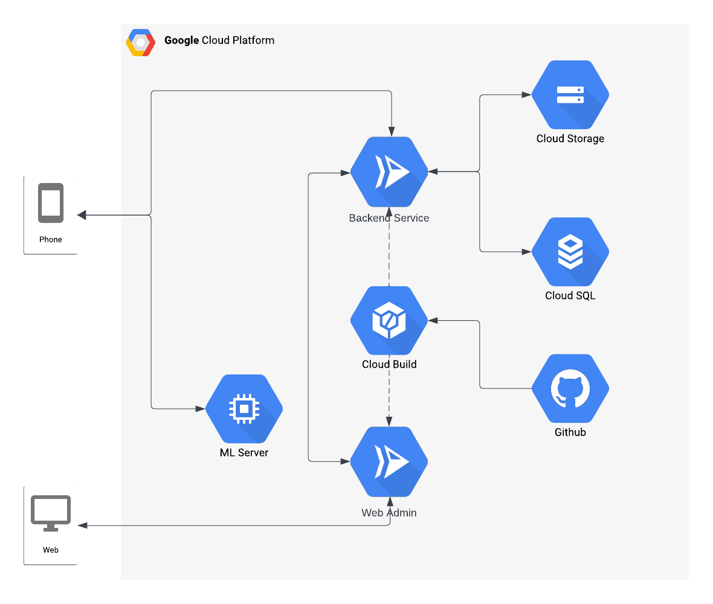

# Hear4U API
This repository contains the server-side code and database setup for the Hear4U Android application and web.
## Techstack
Some several technologies or libraries that we used:
<ol>
  <li>Hapi.js</li>
  <li>Prisma ORM</li>
  <li>JWT</li>
  <li>Cloud Storage</li>
  <li>Cloud SQL</li>
  <li>Cloud Build</li>
  <li>Cloud Run</li>
</ol>

## Get Started
Clone `repository` with command:
```
git clone https://github.com/HEAR4U-bangkit/cc-hear4u-server.git
```

Install dependencies:
```
npm install
```

Copy `.env.example` to `.env` with command:
```
cp .env.example .env
```

Generate `prisma client`:
```
prisma generate
```

Run `prisma` migration and seeder with command:
```
npx prisma migrate deploy && npm run db:seed
```

Start the server with command:
```
npm start
```

## Infrastucture


## API Documentation
Can be accessed at <a href="https://www.postman.com/martian-spaceship-254295/workspace/team-workspace">Postman</a>
or you can download at <a href="./docs/api-documentation.zip">here</a>